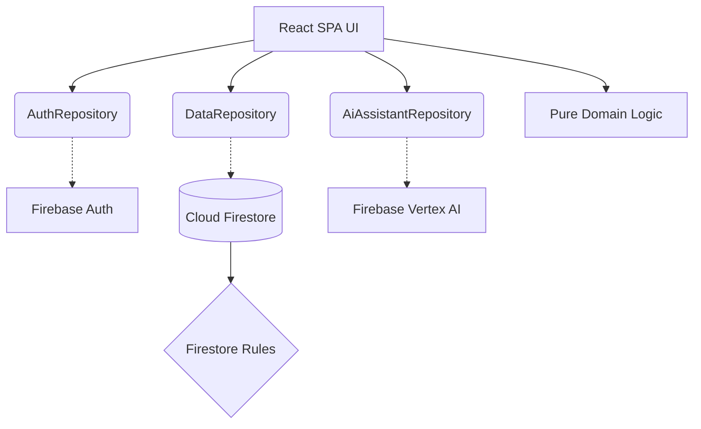

# PrithviProof: Evidence-Based Carbon Assistant

> **Live Application URL:** [https://prithviproof.web.app](https://prithviproof.web.app)

## Challenge 3 Statement
> **"Create a tool that helps users understand, clarify, and take meaningful action on a complex, ambiguous problem in a specific vertical."**

### Chosen Vertical: Personal Carbon Accounting & Mitigation
The **Problem**: Carbon accounting for individuals is ambiguous, guilt-inducing, and often misleading. Generic calculators provide static numbers without context, and "offsets" obscure the need for real emission reductions.
The **Target User**: Environmentally conscious individuals who want rigorous, actionable data to reduce their actual emissions, rather than buying offsets.

### Why PrithviProof is Different
PrithviProof abandons the standard carbon calculator model. It treats carbon mitigation as an accounting problem requiring evidence.
- **No AI Hallucinations**: Carbon calculations are strictly deterministic and rule-based. Gemini acts only as a natural language parser and explanation engine.
- **Uncertainty Aware**: Every estimate includes an uncertainty interval (Low/Central/High).
- **Evidence Ledger**: Recommendations transition from `estimated` -> `planned` -> `in_progress` -> `verified` with an immutable ledger.
- **Projected vs. Verified Savings**: Differentiates between what you plan to save and what you have cryptographically or physically proven to have saved.

## Workflow: Understand → Clarify → Reduce → Verify

1. **Understand**: Users input raw activity data (e.g., flight miles, utility bills) or use natural language parsing to get baseline estimates with confidence intervals.
2. **Clarify**: The **Ask Prithvi** AI widget answers questions about the estimates, clarifying why certain factors were used.
3. **Reduce**: PrithviProof generates actionable recommendations tailored to the user's budget, housing type, and ownership constraints.
4. **Verify**: Users commit to actions in the Evidence Ledger and provide proof (e.g., utility bill reduction) to move savings from `projected` to `verified`.

## Architecture Overview



### Feature Matrix

| Feature | Description |
|---------|-------------|
| **Adaptive Decision Logic** | Questions and recommendations adapt based on user constraints (budget, housing, car ownership). |
| **Smart Parser** | Parses natural language ("I drove 20km in my car") into structured activity data. |
| **Evidence Ledger** | Immutable state machine tracking emission reductions. |
| **Ask Prithvi** | Context-aware AI assistant that can explain calculations. |

## AI Safety & Gemini's Responsibilities

Gemini is strictly contained within the `FirebaseAiAssistantRepository`.
- **Calculations**: Gemini *never* calculates carbon emissions. It only parses text or explains pre-calculated numbers.
- **PII**: No Personally Identifiable Information (email, UID) is ever sent to the model.
- **Structured Output**: Responses are strictly enforced to match JSON schemas and validated via Zod.
- **Fallback**: A `DeterministicFallbackAssistantRepository` is automatically injected if the AI fails or is unavailable.

## Security and Privacy Architecture
- **Firestore Rules**: Strict owner-only access. Schema validation at the database level using `hasOnly` and type constraints.
- **App Check**: Protected by Firebase App Check using reCAPTCHA Enterprise.
- **CSP Headers**: Content Security Policy blocks inline execution and unauthorized domains.

## Testing & Emulators

We maintain high test coverage across domain models and data repositories.

```bash
# Run unit tests and coverage
npm run test:coverage

# Run End-to-End Playwright tests
npm run test:e2e

# Run Firestore Rules tests against the Emulator Suite
npm run test:rules
```

## Local Setup

1. **Prerequisites**: Node.js 20.x, npm.
2. **Install**: `npm ci`
3. **Env Vars**: Copy `.env.example` to `.env.local` and add your Firebase config.
4. **Run**: `npm run dev`

### Environment Variables

```env
VITE_FIREBASE_API_KEY="..."
VITE_FIREBASE_AUTH_DOMAIN="..."
VITE_FIREBASE_PROJECT_ID="..."
VITE_FIREBASE_STORAGE_BUCKET="..."
VITE_FIREBASE_MESSAGING_SENDER_ID="..."
VITE_FIREBASE_APP_ID="..."
VITE_RECAPTCHA_SITE_KEY="..."
```

## Deployment

Deploy strictly to Firebase Hosting and update Firestore Rules:
```bash
npm run build
firebase deploy --only hosting,firestore:rules,firestore:indexes
```

## Accessibility Commitments

Targeting WCAG 2.2 AA.
- Keyboard-only navigation support.
- Aria-dialog and focus-trap for Ask Prithvi and forms.
- High color contrast and semantic HTML5 landmarks.

## Assumptions and Limitations
- The application relies on external emission factors which may require periodic manual updates.
- App Check requires a valid reCAPTCHA enterprise configuration.
