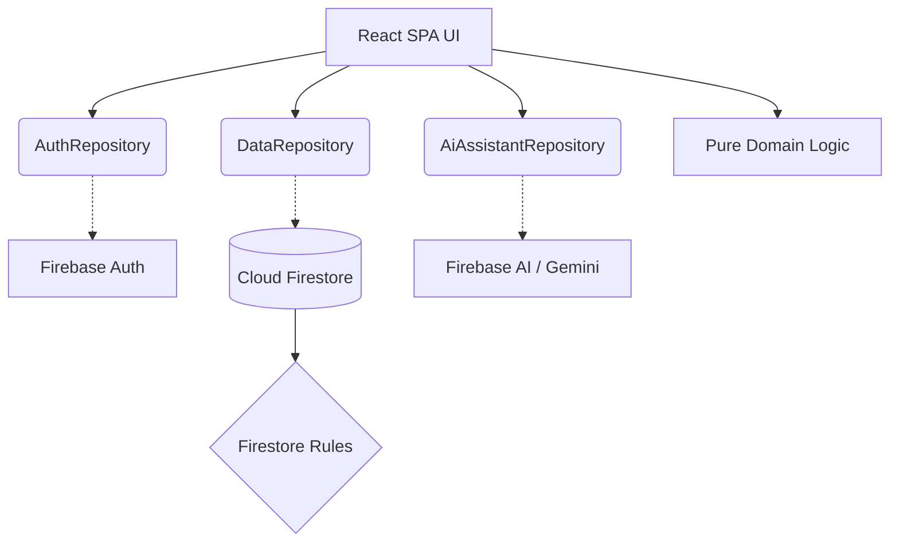

# Architecture

PrithviProof uses a purely client-side React SPA Architecture to achieve a Serverless Backend with Google Firebase.

## Layers
1. **Presentation Layer**: React, Tailwind, React Router.
2. **Repository Layer**: Abstractions (`DataRepository`, `AuthRepository`, `AiAssistantRepository`) that wrap Firebase SDKs.
3. **Domain Layer**: Pure TypeScript logic (`src/domain`) that has zero knowledge of React or Firebase. Contains all math, algorithms, and Zod schemas.
4. **Infrastructure**: Firebase Auth, Firestore, and Firebase AI Logic (Gemini 2.5 Flash).

## Performance Architecture

### Route-Level Code Splitting
All protected application routes (`/dashboard`, `/assessment`, `/log`, `/ledger`, `/recommendations`, `/settings`) use React Router `lazy()` and are excluded from the initial bundle. Only the landing page, public auth routes, and the minimal root layout ship on initial load.

### Lazy AI Loading
`firebase/ai` and `FirebaseAiAssistantRepository` are **never** included in the initial JS bundle. They are loaded via `async import("firebase/ai")` only when the user first opens Ask Prithvi or submits a natural-language activity. This saves ~42 kB raw on initial load.

**Confirmed by build graph:** `firebase/ai` appears only in `FirebaseAiAssistantRepository-*.js` (4.8 kB), which is absent from the initial chunk import graph.

### Modular Firebase Imports
All Firebase usage imports from subpaths only (`firebase/app`, `firebase/auth`, `firebase/firestore`, `firebase/app-check`). No `firebase/compat/*` or namespace imports exist.

### Bounded Firestore Queries
All Firestore `getDocs` calls use explicit `orderBy` + `limit` to prevent unbounded reads:
- Activities: `limit(500)`
- Ledger: `limit(200)`

### Measured Initial Bundle (post-optimization)
| Chunk | Raw | Gzip |
|---|---|---|
| index (app entry) | 326 kB | 94.9 kB |
| firebase core | 510 kB | 119.5 kB |
| vendor (react) | 103 kB | 34.9 kB |
| **firebase/ai (lazy)** | **4.8 kB** | **2.1 kB** |

**Before optimization:** `firebase/ai` was bundled inside the 42 kB `createAiRepository` chunk that loaded on every page. After optimization it is isolated and deferred.

### Bundle Budget
`npm run check:bundle` enforces a 650 kB initial-entry JS budget (excluding lazy chunks). Current: ~420 kB ✅
